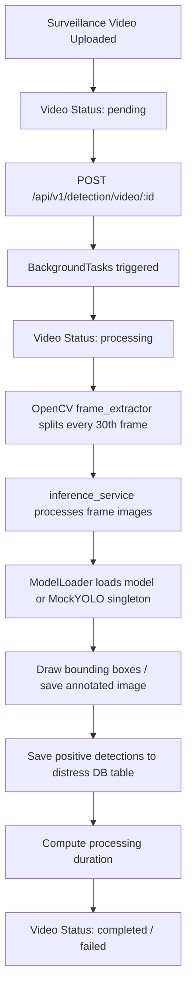

# AI Distress Detection Pipeline

This document details the configuration and architecture of the automated AI road distress detection pipeline.

## Pipeline Architecture



---

## Component Details

### 1. Model Loading & Mock YOLO (`model_loader.py`)
* The singleton `ModelLoader` class attempts to lazily load model weights from `backend/models/best.pt` using the `ultralytics` package.
* If the file does not exist, or the package is not installed, it falls back to a simulated `MockYOLO` model.
* The mock model simulates the Ultralytics output API structures, generating random detections (bounding boxes, class labels, and confidence values) mapped to realistic GPS coordinate clusters.

### 2. Frame Extraction (`frame_extractor.py`)
* Extracts frame slices from video streams using `cv2.VideoCapture`.
* The standard interval extracts one frame per 30 frames (adjustable).
* Frames are written to disk inside the `uploads/frames/{video_id}/` subdirectory.

### 3. Inference & Image Annotation (`inference_service.py`)
* Feeds frame images into the loaded YOLO model.
* On successful distress identifications (confidence >= 0.45), drawing utilities paint colored rectangles and label metadata overlays directly onto duplicate frame copies.
* The resulting visual records are stored under `uploads/detections/{video_id}/`.

### 4. Database Persistence (`detection_service.py`)
* Runs the process within background thread boundaries.
* Saves geo-tagged anomalies by calling the distress CRUD functions.
* Keeps track of processing milestones (`processing_started_at`, `processing_completed_at`, `processing_duration`) to measure execution performance.

---

## Production Weights Deployment

To replace the mock YOLO simulation with a live trained model:
1. Place your PyTorch weights file at `backend/models/best.pt`.
2. Ensure you have the `ultralytics` package installed in your active environment:
   ```bash
   pip install ultralytics
   ```
3. Restart the FastAPI backend server. The `ModelLoader` singleton will automatically detect the file and instantiate a real `YOLO("best.pt")` object.
