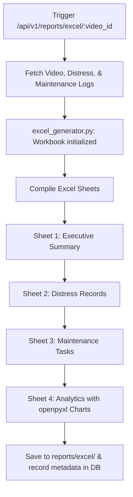

# Excel Report Generation System

This document details the configuration, architecture, and endpoints of the automated Excel Report Generation System for the Road Distress Management System.

## Architecture & Layout Flow

The reporting engine uses the `openpyxl` library to compile structured, stakeholder-ready Excel workbooks containing comprehensive distress telemetry and maintenance recommendations.



---

## Component Details

### 1. Sheet 1: Executive Summary
* **Content:** 
  * Title block and document metadata (Report ID, Generated Timestamp, Video File, Video ID, Status).
  * Distress Severity Distribution table mapping severity levels (Critical, High, Medium, Low) to anomaly counts and urgency guidelines.
  * Total anomalies formula cell using `=SUM(B14:B17)`.
* **Styling:** Premium Navy header fills (`#1F4E78`), zebra striping, and bold/color-coded severity warning typography (red for Critical, orange for High).

### 2. Sheet 2: Distress Records
* **Columns:**
  * Distress ID
  * Distress Type
  * Severity (bold, color-coded)
  * Confidence Score (formatted as percentage `0.0%`)
  * Latitude & Longitude (formatted with 5 decimal places `0.00000`)
  * Video Timestamp (s) (formatted to 1 decimal place `0.0`)
  * Frame Number
  * Prescribed Recommendation (from associated maintenance task)
* **Styling:** Header row with custom height (28pt) and alignment, zebra row styling, and auto-adjusted column dimensions.

### 3. Sheet 3: Maintenance Tasks
* **Columns:**
  * Task ID
  * Distress ID
  * Priority Rank (P1-P4)
  * Prescribed Maintenance Action
  * Scheduling Status
  * Estimated Response Window
  * Estimated Repair Cost (formatted as currency `₹#,##0`)
* **Styling:** Color-coded priority fonts, zebra striping, and auto-adjust widths.

### 4. Sheet 4: Analytics
* **Tables:**
  * Distress Type Distribution
  * Severity Distribution
  * Overall system-wide Detection Count Per Video (queries all registered videos)
* **Visuals (Embedded Charts):**
  * **Bar Chart:** Visual representation of anomalies grouped by severity level.
  * **Pie Chart:** Percentage category breakdown of distress types.
* **Layout:** Gridlines enabled explicitly, clean column gaps, and thick-bordered table boundaries.

---

## API Endpoints

All reporting endpoints are grouped under the `/api/v1/reports` prefix:

### 1. Generate Excel Report
* **Path:** `POST /api/v1/reports/excel/{video_id}`
* **Description:** Compiles distress logs and maintenance tasks into a styled spreadsheet, logging metadata in database.
* **Response Status:** `201 Created`
* **Schema:** `ReportResponse` (with `report_type="EXCEL"`)

### 2. Download Excel Report
* **Path:** `GET /api/v1/reports/excel/download/{report_id}`
* **Description:** Downloads the compiled `.xlsx` spreadsheet file using appropriate file headers.
* **Response:** File stream (`application/vnd.openxmlformats-officedocument.spreadsheetml.sheet`)

### 3. Retrieve Report Metadata Log
* **Path:** `GET /api/v1/reports/{id}`
* **Description:** Retrieve metadata information (name, generation timestamp, filepath) for a single report.
* **Schema:** `ReportResponse`

### 4. List All Reports
* **Path:** `GET /api/v1/reports/`
* **Description:** Retrieve the history of all generated report logs (both PDF and Excel).
* **Schema:** `List[ReportResponse]`

### 5. Delete Report Log
* **Path:** `DELETE /api/v1/reports/{id}`
* **Description:** Deletes report metadata from the database and removes references.
* **Schema:** `ReportResponse`

---

## Testing & Verification

We have created an automated integration test to verify the complete lifecycle of Excel reports:

```bash
# Execute the integration tests (ensure development server is running)
.venv\Scripts\python.exe test_excel_report_generation.py
```

The script performs:
1. **Uploads** a test video.
2. **Processes** it through the AI pipeline to obtain mock road distress logs.
3. **Generates** the safety audit Excel report.
4. **Verifies** the raw binary signature of download endpoint (`PK\x03\x04` headers).
5. **Lists** and queries the report metadata logs.
6. **Cleans up** the database records and physical video files from disk.
