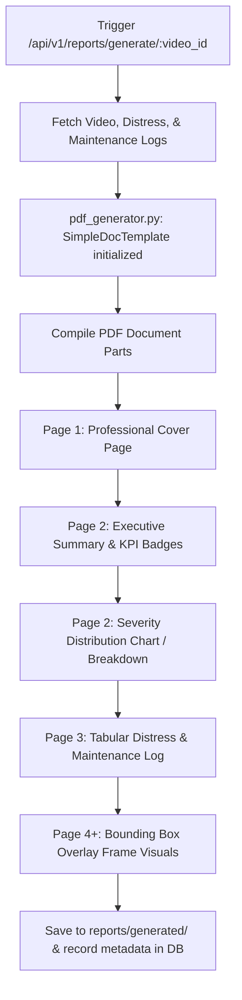

# PDF Report Generation System

This document details the configuration, architecture, and endpoints of the automated PDF Report Generation System for the Road Distress Management System.

## Architecture & Layout Flow

The reporting engine uses the `reportlab` library to compile structured, professional, print-ready safety audit documents.



---

## Component Details

### 1. Cover Page Layout
* Styled using a professional design palette: Primary deep slate (`#1e293b`), Accent deep indigo (`#4f46e5`), and border dividers.
* Incorporates document title, metadata block (Generated Date, Creator, Target Video File, System status), and a clean decorative layout.

### 2. Executive Summary & KPIs
* Highlights key telemetry data in structured tables styled as KPI blocks:
  * **Total Distresses Detected**
  * **Critical Distress Occurrences**
  * **Estimated Response Urgency**
  * **Total Maintenance Recommendations**
* Categorizes anomalies by severity distribution (Critical, High, Medium, Low) and type.

### 3. Tabular Distress & Maintenance Records
* Generates clear tabular grids listing:
  * Distress ID, coordinates (Latitude, Longitude), and detected time.
  * Prescribed maintenance action, priority level, estimated response window, and cost category.
* Uses zebra striping and defined column widths with text wrapping to ensure readability.

### 4. Bounding Box Frame Visuals
* Dynamically embeds frame screenshots from the AI pipeline detections (`uploads/detections/{video_id}/`).
* Limits image sizes to prevent page overflow and scaling errors.
* Formats images with neat borders and descriptive subtitles.

---

## API Endpoints

All reporting endpoints are grouped under the `/api/v1/reports` prefix:

### 1. Generate PDF Report
* **Path:** `POST /api/v1/reports/generate/{video_id}`
* **Description:** Generates a professional PDF report containing the distress telemetry and maintenance recommendations.
* **Response Status:** `201 Created`
* **Schema:** `ReportResponse`

### 2. Download PDF Report
* **Path:** `GET /api/v1/reports/download/{report_id}`
* **Description:** Downloads the compiled PDF file with appropriate headers (`Content-Disposition: attachment`).
* **Response:** File stream (`application/pdf`)

### 3. Preview PDF Report
* **Path:** `GET /api/v1/reports/preview/{report_id}`
* **Description:** Renders the PDF inline inside the web browser tab (`Content-Disposition: inline`).
* **Response:** File stream (`application/pdf`)

### 4. Retrieve Report Metadata Log
* **Path:** `GET /api/v1/reports/{id}`
* **Description:** Retrieve metadata information (name, generation timestamp, filepath) for a single report.
* **Schema:** `ReportResponse`

### 5. List All Reports
* **Path:** `GET /api/v1/reports/`
* **Description:** Retrieve the history of all generated report logs.
* **Schema:** `List[ReportResponse]`

### 6. Delete Report Log
* **Path:** `DELETE /api/v1/reports/{id}`
* **Description:** Deletes report metadata from the database.
* **Schema:** `ReportResponse`

---

## Testing & Verification

We have created an automated integration test to verify the complete life cycle of reports:

```bash
# Execute the integration tests (ensure development server is running)
.venv\Scripts\python.exe test_report_generation.py
```

The script performs:
1. **Uploads** a test video.
2. **Processes** it through the AI pipeline to obtain mock road distress logs.
3. **Generates** the safety audit PDF report.
4. **Verifies** the raw binary signature of download/preview endpoints (`%PDF` headers).
5. **Lists** and queries the report metadata logs.
6. **Cleans up** the database records and physical video files from disk.
